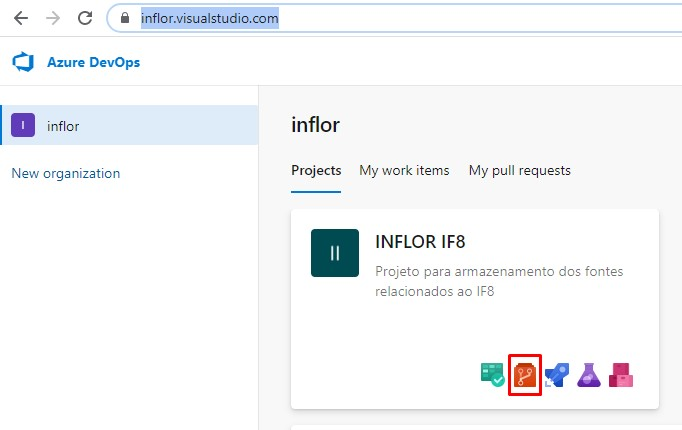
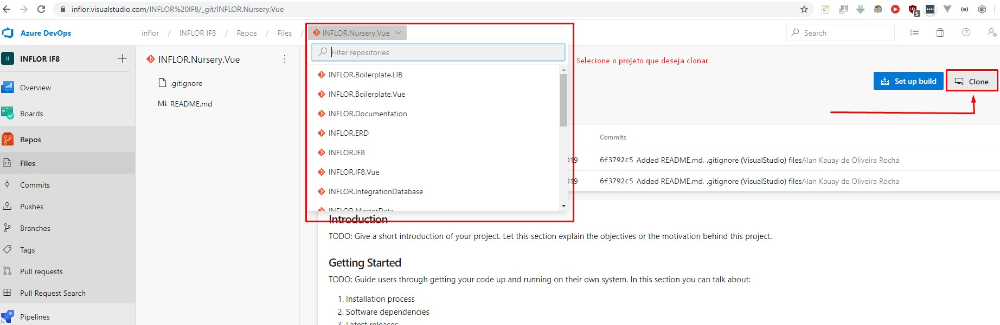
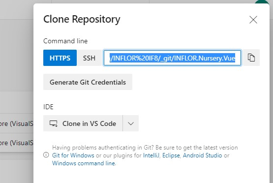

# GIT

## Boas práticas no GIT
> É uma boa prática fazer uso do *GIT FLOW*  que pode ser melhor explicado nos  dois artigos abaixo

[medium - Utilizando o fluxo Git Flow](https://medium.com/trainingcenter/utilizando-o-fluxo-git-flow-e63d5e0d5e04)

[medium - Tutorial: Git com Git Flow.](https://medium.com/@lariodiniz/tutorial-git-com-git-flow-476ad906c8ae)

> Também é uma boa prática fazer uso de padrões de mensagem no commit, um bom exemplo é o padrão da comunidade Angular

[CONVENCIONAL COMMIT MESSAGE](https://www.conventionalcommits.org/pt-br/v1.0.0-beta.4/)

## Como configurar Git
> para melhorar sua expência com Git segue abaixo algumas dicas de configuração

- desative o **autocrlf** para que o git não converta o formato dos seu arquivo automaticamente
  ```
  git config --global core.autocrlf false
  ``` 

- troque o editor padrão do git (vim) para vscode
  
    ```
    git config --global core.editor code
    ```
  > após este comando acesse
    ```
    git config --globa --edit
    ```
  > dentro do editor você pode livremente personalizar suas configurações do GIT

  Ex.: 
  ```YAML
  [user]
    name = Adriano Reis
    email = adriano.reis@inflor.com.br
  [diff]
    guitool = kdiff3
  [winUpdater]
    recentlySeenVersion = 2.25.1.windows.1
  [i18n]
    filesEncoding = utf-8
  [core]
    autocrlf = false
    editor = code --wait
  ```

- Adicionar Alias ao git para facilitar seu comandos
  ```YAML
    <!-- other configs -->
    [alias]
    s = !git status -s
    c = !git add --all && git commit -m
    l = !git log --pretty=format:'%C(blue)%h%C(red)%d %C(white)%s - %C(cyan)%cn, %C(green)%cr'
    a = !git commit --amend --no-edit
  ```
  > exemplo de uso 
  ```
    git c "minha mensagem de commit"
  ```

## Como clonar um repositório ?

Acesse a sua conta no VisualStudio em https://inflor.visualstudio.com/






## Como fazer um commit ?
...

## Como fazer uma pull request ?
...

## O que são artefatos ?
...

### Como Atualizar seus artefatos ?

[BACK TO HOME](README.md)